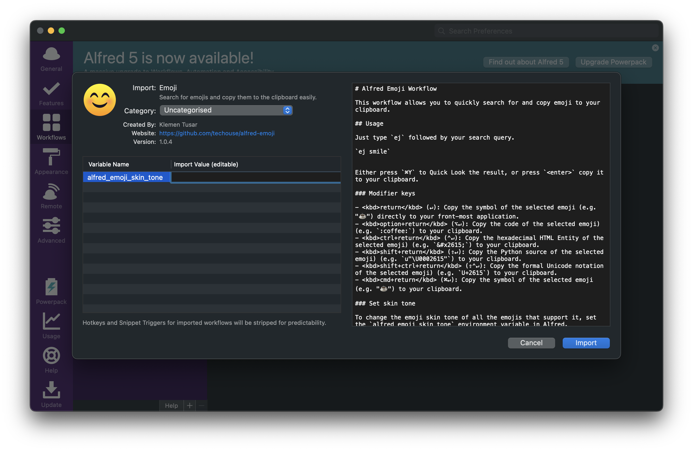

# Alfred Emoji Workflow


This workflow allows you to quickly search for and copy emoji to your clipboard.


## Installation

1. [Download the latest version](https://github.com/techouse/alfred-emoji/releases/latest)
2. Install the workflow by double-clicking the `.alfredworkflow` file
3. You can add the workflow to a category, then click "Import" to finish importing. You'll now see the workflow listed in the left sidebar of your Workflows preferences pane.

## Usage

Just type `ej` followed by your search query.

```
ej smile
```

Either press `⌘Y` to Quick Look the result, or press `<enter>` copy it to your clipboard.

### Modifier keys

- <kbd>return</kbd> (↵): Copy the symbol of the selected emoji (e.g. "☕️") to your clipboard.
- <kbd>option+return</kbd> (⌥↵): Copy the code of the selected emoji) (e.g. `:coffee:`) to your clipboard.
- <kbd>ctrl+return</kbd> (⌃↵): Copy the hexadecimal HTML Entity of the selected emoji) (e.g. `&#x2615;`) to your clipboard.
- <kbd>shift+return</kbd> (⇧↵): Copy the Python source of the selected emoji) (e.g. `u"\U0002615"`) to your clipboard.
- <kbd>shift+ctrl+return</kbd> (⇧⌃↵): Copy the formal Unicode notation of the selected emoji) (e.g. `U+2615`) to your clipboard.
- <kbd>cmd+return</kbd> (⌘↵): Copy the symbol of the selected emoji (e.g. "☕️") directly to your front-most application.

### Set skin tone

To change the emoji skin tone of all the emojis that support it, set the `alfred_emoji_skin_tone` environment variable in Alfred.
Possible **integer** values are:

- `1` - *light* skin tone,
- `2` - *medium-light* skin tone,
- `3` - *medium* skin tone,
- `4` - *medium-dark* skin tone,
- `5` - *dark* skin tone



### Notes

Kudos to [jsumners/alfred-emoji](https://github.com/jsumners/alfred-emoji) for the initial inspiration.

Emoji index built from [i-Naji/emojis](https://github.com/i-Naji/emojis).

Displayed emoji images from [joypixels/emoji-assets](https://github.com/joypixels/emoji-assets).

Lightning fast search is powered by [Algolia](https://www.algolia.com).
